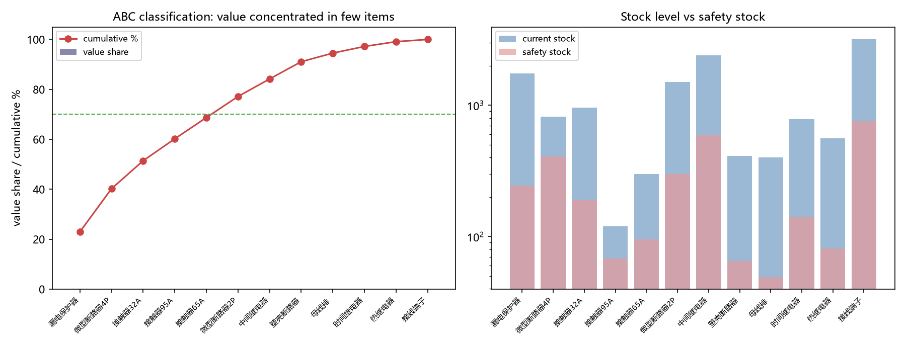

# Inventory Optimization Analysis (Electrical Materials)

> **⚠️ Sample data disclaimer:** all data (`data/sample_data.xlsx`) is **fictional /
> synthetic**, created for learning and practice only. It contains no real customer,
> supplier, or business information.
>
> This project was built collaboratively with **Claude Code** (an AI coding
> assistant) alongside the author, as a personal supply-chain portfolio piece.

A minimal end-to-end **supply chain inventory analysis** project implemented in
plain Python. It demonstrates the classic inventory-management toolkit that supply-chain
planners use daily, rebuilt from scratch with `pandas` and `matplotlib`.

## What it does

Given a single table of 12 electrical-material SKUs (`data/sample_data.xlsx`),
the pipeline runs four classic analysis steps and outputs a replenishment kanban:

| Step | What | Output |
|------|------|--------|
| 1 | **ABC classification** | Split items into A / B / C by annual consumption value (A = top 70% of value) |
| 2 | **Safety stock** | Safety stock for each SKU at a 90% service level |
| 3 | **EOQ** | Economic Order Quantity balancing order and holding costs |
| 4 | **Replenishment kanban** | Flags each SKU as `OK` / `URGENT restock` / `OVERSTOCK risk` |

The logic mirrors classic planning skills (VLOOKUP / SUMIFS / pivot tables) but
implemented programmatically — the same reasoning a demand planner would apply,
made reproducible and auditable.

## Tech stack

- Python 3
- pandas (data manipulation)
- matplotlib (visualization)
- openpyxl (xlsx read/write, via pandas)

## Quick start

```bash
# 1. Install dependencies (into a virtualenv recommended)
pip install pandas matplotlib openpyxl

# 2. Run from the repository root
python src/inventory_optimization.py
```

The script reads `data/sample_data.xlsx`, and writes:

- `output/inventory_optimization_result.xlsx` / `.csv` — the analysis tables
- `figures/inventory_visualization.png` — the summary chart

## Example output



The kanban result identifies which SKUs sit **below their safety stock** (need
restocking) and which sit **above a 2x monthly-demand coverage** (overstock risk),
so a planner knows exactly where to focus attention.

## Skills demonstrated

- Data cleaning and manipulation with `pandas`
- Business logic encoded as reusable, readable functions (ABC rule, EOQ, service-level safety stock)
- Data visualization for reporting
- Reproducible pipeline with a clean, documented repo structure

## License

MIT — see [LICENSE](LICENSE).